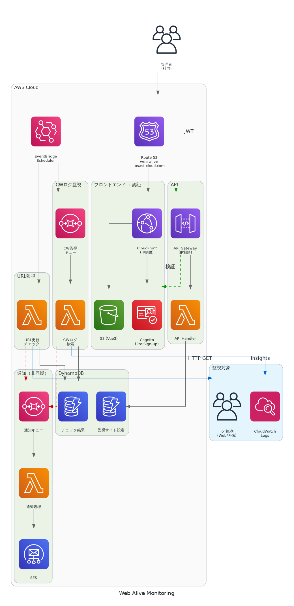
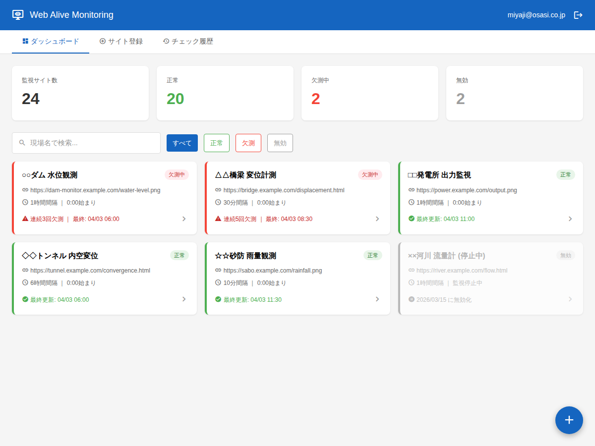
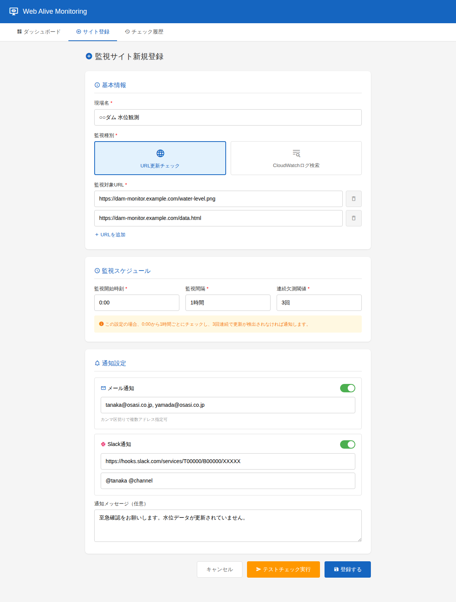
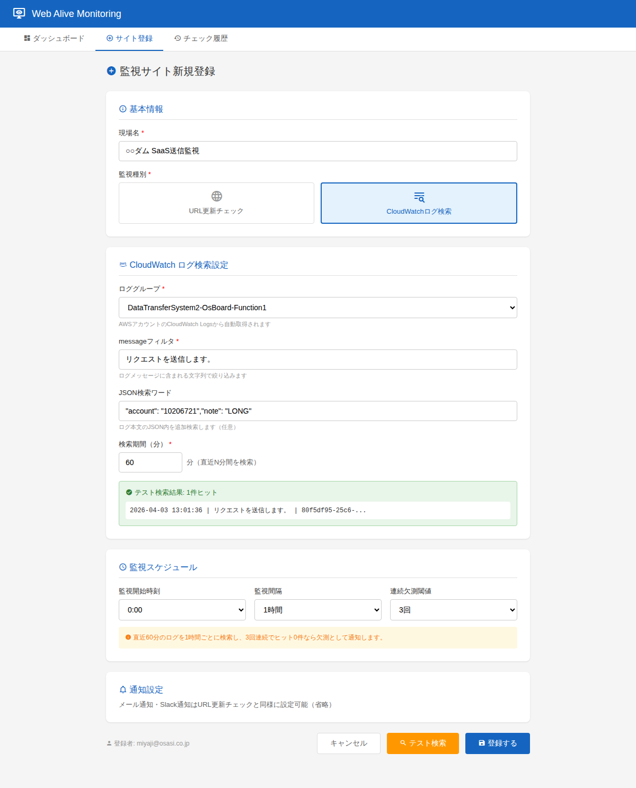

# Web死活監視システム 計画仕様書

## 1. 概要

### 1.1 目的

IoT観測システム（SaaS・Windowsソフトのアップロード機能等）が定期的に更新するWebページ・画像などの**データ欠測を保守担当者がいち早く感知する**ための監視・通知システムを構築する。

### 1.2 背景

- 複数の現場でIoT観測システムが稼働しており、それぞれがWebページや画像を定期的に更新している
- 更新が停止した場合（データ欠測）、現場担当者が気づくまでに時間がかかることがある
- 人手による定期確認は非効率で見落としリスクがある
- CloudWatchログに出力されるエラーも統合的に監視したい

### 1.3 システム名

**Site Monitor**（Web死活監視システム）

---

## 2. 要件定義

### 2.1 機能要件

#### 2.1.1 監視サイト管理

| 項目 | 内容 |
|------|------|
| 現場名 | 監視対象を識別する名称（例: ○○ダム、△△橋梁） |
| 監視URL | 定期的に更新されるWebページ・画像のURL（複数登録可） |
| 監視種別 | URL更新チェック / CloudWatchログ検索 |
| 監視開始時刻 | 監視サイクルの起点（例: 0:00） |
| 監視間隔 | チェック頻度（例: 1時間、30分、6時間） |
| 連続欠測閾値 | X回連続で更新なしの場合に通知（例: 3回） |
| 有効/無効 | 監視の一時停止が可能 |

#### 2.1.2 URL更新チェック — 観測ソフトの生存確認

**背景:** Windows観測ソフトにはホームページ作成機能があり、ユーザーのレンタルサーバーに観測データの表・グラフのスクリーンショット画像を定期的にアップロードしてWebページを自動更新する。この更新が止まった場合、観測ソフト自体が停止している可能性が高い。

**判定方法:**
- **方法1（優先）**: HTTPレスポンスの`Last-Modified`ヘッダ / `ETag`を前回値と比較
- **方法2（フォールバック）**: レスポンスボディのSHA-256ハッシュを前回値と比較
- ヘッダが取得できない場合は自動的にコンテンツハッシュ比較にフォールバック
- チェック結果（更新あり/なし、タイムスタンプ、ハッシュ値）をDynamoDBに記録

#### 2.1.3 CloudWatchログ検索 — データ送信の生存確認

**背景:** IoT通信機はメール形式でバックエンド（NetMAIL-Backend）にデータを送信する。バックエンドは受信データを以下の2系統で転送する。いずれもLambdaで処理されるためCloudWatch Logsにログが記録されており、同じ仕組みで監視可能。

```
通信機 → メール形式 → NetMAIL-Backend (AWS Lambda)
                        ├→ DataTransferSystem（JSON変換）→ SaaS API
                        │   ログ: "リクエストを送信します。" + account/note
                        └→ Subscriber（メール転送）→ ASP (example-company-asp.jp)
                            ログ: "メールを配信します。" + source/to
```

**監視方法:**
- ロググループ + messageフィルタ + JSON検索ワードを登録
- 指定期間（例: 直近60分）内にマッチするログが**0件の場合を欠測と判定**
- 検索はCloudWatch Logs Insights APIを使用
- 検索結果（ヒット件数・最終ヒット日時）をDynamoDBに記録

**具体的な設定例:**

| 用途 | ロググループ | messageフィルタ | JSON検索ワード | 期間 |
|------|------------|---------------|--------------|------|
| SaaS送信監視 | DataTransferSystem2-ExBoard-Function1 | `リクエストを送信します。` | `"account": "99999999","note": "LONG"` | 60分 |
| ASP送信監視 | NetMAIL-Backend-Subscriber | `メールを配信します。` | `99999999@ml.example-cloud.com` | 60分 |

#### 2.1.4 通知

- 現場ごとに通知先を個別設定
- **メール通知**: Amazon SES経由で指定アドレスに送信。送信元: `Example.NET<noreply@alive.example-cloud.com>`（netmail-backend準拠）
- **Slack通知**: Incoming Webhook URLを設定し、指定チャンネルにメンション付きメッセージ送信
- **状態変化時のみ通知**: 毎回の監視結果で通知するのではなく、状態が変化（正常→異常 / 異常→正常）したタイミングでのみ通知する（アラート疲れ防止）
- 状態変化はすべて status_changes テーブルに記録し、画面から変化履歴を参照可能
- 通知メッセージはテンプレート化し、現場名・欠測情報・任意メッセージを含む
- 通知テンプレート例:
  ```
  ⚠️ データ欠測検知
  【現場名】○○ダム
  【対象URL】https://example.com/data/latest.png
  【状態変化】正常 → 異常（欠測検知）
  【最終更新】2026-04-03 09:00:00
  【メッセージ】{管理者が設定した任意メッセージ}
  ```

#### 2.1.5 管理UI

- 監視サイトのCRUD操作（登録・参照・更新・削除）
- 通知先の設定（メール・Slack・メンション先）
- 監視状態ダッシュボード（正常/欠測/無効の一覧表示）
- チェック履歴の参照
- 状態変化履歴の参照（正常⇔異常の遷移タイミングと原因URLを時系列表示）

#### 2.1.6 ユーザー管理

- **パスワードリセット**: ログイン画面から「パスワードをお忘れですか？」でセルフリセット（Amplify標準機能）
- **自ユーザー削除**: サイト登録が0件の場合、自分のアカウントを削除可能
- **管理者画面** (`/admin/users`): ベーシック認証で保護された管理者専用画面
  - ユーザー一覧表示（メール、ステータス、有効/無効、登録サイト数）
  - ユーザーの有効/無効切替
  - パスワードリセット
  - ユーザー削除（登録サイト0件が条件）
- **管理者オーバーライド**: 管理者認証により他ユーザーのサイトをPUT/DELETE可能（退職者対応等）

### 2.2 非機能要件

| 項目 | 要件 |
|------|------|
| 可用性 | サーバーレス構成で高可用性を確保 |
| セキュリティ | 社内グローバルIPによるアクセス制限 + Cognito認証 |
| 監視対象数 | 初期100サイト程度、最大500サイト |
| 監視間隔 | 最短5分、最長24時間 |
| 通知遅延 | 欠測検知後5分以内に通知 |
| 運用コスト | サーバーレスで従量課金、低コスト運用 |

---

## 3. アーキテクチャ設計

### 3.1 全体構成図



### 3.2 コンポーネント一覧

| コンポーネント | AWSサービス | 役割 |
|---------------|------------|------|
| フロントエンド | S3 + CloudFront + Route 53 | Vue3 SPAホスティング、IP制限、`https://site-monitor.example-cloud.com/` |
| 認証 | Cognito User Pool | ユーザー認証・認可（セルフサインアップ、ドメイン制限） |
| API | API Gateway + Lambda | REST APIエンドポイント（リソースポリシーでIP制限） |
| データストア | DynamoDB | 監視設定・チェック結果・通知設定 |
| 定期実行 | EventBridge Scheduler | Cron式によるLambda定期起動（1サイト1スケジュール） |
| URL監視 | Lambda | HTTP GET + 更新判定 |
| CWログ監視 | SQS + Lambda | SQSキュー経由で順次実行（同時クエリ上限制御） |
| 通知キュー | SQS | 欠測検知時に通知メッセージをキューイング（非同期化） |
| 通知処理 | Lambda | SQSから受信し、SES/Slack Webhookで通知 |
| メール通知 | SES | メール配信。送信元: `Example.NET<noreply@alive.example-cloud.com>`、ドメイン `alive.example-cloud.com` をEmailIdentityで検証 |
| Slack通知 | Lambda | Slack Incoming Webhook呼出 |

### 3.3 定期実行の仕組み（EventBridge Scheduler）

**Amazon EventBridge Scheduler** を使用して、Lambda関数を定期的に起動する。

#### 動作原理

1. ユーザーがUIから監視設定を登録すると、API Lambda が EventBridge Scheduler のスケジュールを動的に作成
2. スケジュールは Cron 式で定義（例: `cron(0 * * * ? *)` = 毎時0分）
3. 指定時刻になると Scheduler が監視 Lambda を起動
4. Lambda は DynamoDB から対象の監視設定を読み込み、チェックを実行

#### Cron式の例

| 現場 | 監視間隔 | 開始時刻 | Cron式 |
|------|---------|---------|--------|
| ○○ダム | 1時間 | 0:20始まり | `cron(20 * * * ? *)` |
| △△橋梁 | 10分 | 0:05始まり | `cron(5/10 * * * ? *)` |
| □□発電所 | 1時間 | 0:50始まり | `cron(50 * * * ? *)` |

#### スケジュール管理方針

**1サイト＝1スケジュール**。サイト登録時にEventBridge Schedulerのスケジュールを1つ作成し、削除時に削除する。

- サイト間が完全に独立し、障害が波及しない
- CRUD時にスケジュール1つを操作するだけでシンプル
- 開始時刻はユーザーが自由に設定可能（データ到達タイミングに合わせる）
- EventBridge Schedulerの上限は**1,000万/リージョン**、コストも**1,400万回/月まで無料**であり、1サイト1スケジュールでも全く問題ない

### 3.4 CWログ監視の実行方式（SQSキュー方式）

CWログ監視は1サイト1スケジュールだが、CloudWatch Logs Insightsの**同時クエリ上限が30/アカウント**であるため、同時刻に多数のLambdaが起動すると上限に抵触する。これを防ぐため、CWログ監視はSQSキューを経由して順次実行する。

```
EventBridge Scheduler（各サイト）
  ↓ site_idを含むメッセージを送信
SQS（CWログ監視キュー）
  ↓ Lambda同時実行数=1に制限
Lambda（CWログ検索）
  ├── キューからsite_idを取得
  ├── DynamoDBから検索条件を読込
  ├── CloudWatch Logs Insights APIでクエリ実行
  └── 結果をDynamoDBに記録 → 欠測時は通知キューへ
```

### 3.5 通知の非同期化（SQSキュー方式）

監視Lambdaが欠測を検知した場合、直接SES/Slackを呼ばず、SQS通知キューにメッセージを送信する。通知Lambdaがキューから受信して実際の送信を行う。

```
監視Lambda（URL or CWログ）
  ↓ 欠測検知時にメッセージ送信
SQS（通知キュー）
  ↓
Lambda（通知処理）
  ├── SES → メール送信
  └── Slack Webhook → チャンネル投稿
  失敗時 → DLQ（Dead Letter Queue）に退避
```

**メリット:**
- 通知先（SES/Slack）の障害が監視処理に影響しない
- SQSの自動リトライにより通知の確実性が向上
- DLQで最終的に失敗した通知を記録・追跡可能
- 将来の通知先追加（Teams、LINE等）が容易

---

## 4. 技術選定

### 4.1 フロントエンド

| 項目 | 選定 | 理由 |
|------|------|------|
| フレームワーク | Vue 3 (Composition API) | ユーザー指定 |
| UIライブラリ | Vuetify 3 | Material Design、管理画面に適したコンポーネント群 |
| ビルドツール | Vite | 高速ビルド、Vue3との親和性 |
| 状態管理 | Pinia | Vue3標準の状態管理 |
| HTTP通信 | axios | API Gateway との通信 |
| 認証SDK | aws-amplify | Cognito認証の統合 |

### 4.2 バックエンド

| 項目 | 選定 | 理由 |
|------|------|------|
| ランタイム | Python 3.13 | Lambda標準、社内レイヤ（OsasiPowertoolsPython）対応ランタイム |
| IaC | AWS SAM | Lambda + API Gatewayの管理に最適 |
| API設計 | REST (API Gateway) | シンプルなCRUD操作に適切 |
| ロガー | OsasiPowertoolsPython | 社内標準Lambda Logger |

#### ログレベル制御

Lambda関数のログ出力量を環境変数 `LogLevel` で制御する。samconfig.tomlの `parameter_overrides` で環境別に設定する。

| 環境 | LogLevel | 出力内容 |
|------|----------|----------|
| 検証（default） | `DEBUG` | リクエスト/レスポンス詳細、クエリ内容、判定ロジックの過程 |
| 本番（production） | `INFO` | 正常系は最小限（開始・終了）、エラー・欠測検知のみ詳細出力 |

本番環境で一時的にデバッグが必要な場合は、Lambda環境変数を直接変更して即時切替が可能（次回デプロイで `samconfig.toml` の値に戻る）。

### 4.3 データストア（DynamoDB）

#### テーブル設計

**sites テーブル**（監視サイト設定）

| 属性 | 型 | 説明 |
|------|------|------|
| site_id (PK) | String | UUID |
| site_name | String | 現場名 |
| monitor_type | String | `url_check` / `cloudwatch_log` |
| targets | List | 監視対象URL or ログ設定のリスト |
| schedule_start | String | 監視開始時刻（HH:MM） |
| schedule_interval_minutes | Number | 監視間隔（分） |
| consecutive_threshold | Number | 連続欠測閾値 |
| enabled | Boolean | 有効/無効 |
| scheduler_arn | String | EventBridge SchedulerのARN |
| last_check_status | String | 最新チェック状態（`updated`/`not_updated`/`error`） ※非正規化 |
| last_checked_at | String | 最終チェック日時 ※非正規化 |
| consecutive_miss_count | Number | 現在の連続欠測回数 ※非正規化 |
| created_by | String | 登録者メールアドレス（Cognito JWTから取得） |
| updated_by | String | 最終更新者メールアドレス |
| created_at | String | 作成日時（ISO 8601） |
| updated_at | String | 更新日時（ISO 8601） |

**check_results テーブル**（チェック結果）

| 属性 | 型 | 説明 |
|------|------|------|
| site_id (PK) | String | 監視サイトID |
| checked_at#target_url (SK) | String | チェック日時#対象URL（複合キー、複数URL対応） |
| status | String | `updated` / `not_updated` / `error` |
| last_modified | String | Last-Modifiedヘッダ値 |
| etag | String | ETag値 |
| content_hash | String | コンテンツSHA-256ハッシュ |
| consecutive_miss_count | Number | 連続欠測回数 |
| ttl | Number | 自動削除用TTL（90日後のエポック秒） |

**notifications テーブル**（通知設定）

| 属性 | 型 | 説明 |
|------|------|------|
| site_id (PK) | String | 監視サイトID |
| notification_id (SK) | String | UUID |
| type | String | `email` / `slack` |
| destination | String | メールアドレス or SSM Parameter名（Slack Webhook URL） |
| mention | String | Slack メンション先（@user, @channel等） |
| message_template | String | 通知メッセージテンプレート |
| enabled | Boolean | 有効/無効 |

**status_changes テーブル**（状態変化履歴）

| 属性 | 型 | 説明 |
|------|------|------|
| site_id (PK) | String | 監視サイトID |
| changed_at (SK) | String | 状態変化日時（ISO 8601） |
| previous_status | String | 変化前の状態（`updated` / `not_updated` / `error`） |
| new_status | String | 変化後の状態 |
| trigger_url | String | 変化を検知した対象URL or ロググループ |
| ttl | Number | 自動削除用TTL（365日後のエポック秒） |

### 4.4 セキュリティ

| レイヤー | 対策 |
|---------|------|
| ネットワーク | CloudFront + S3バケットポリシーで社内グローバルIPのみ許可、Route 53でカスタムドメイン |
| 認証 | Cognito User Pool（Liteプラン）によるユーザー認証 |
| 管理者認証 | ベーシック認証（X-Admin-Authヘッダー）による管理者機能の保護 |
| パスワードポリシー | 最低8文字、英大小文字+数字必須、記号不要 |
| サインアップ制限 | Cognito Pre Sign-upトリガーで社内メールドメイン（`@example.com`）のみ許可 |
| ログイン画面 | Vue3カスタムログイン画面（aws-amplify Auth モジュール使用） |
| ユーザー登録 | **セルフサインアップ**（メールアドレス + パスワード → メール確認コードで本人確認） |
| MFA | 任意（オプション）— ユーザーが自分でTOTP（Google Authenticator等）を設定可能 |
| 操作者追跡 | 全データに登録者・最終更新者（メールアドレス）を記録し、画面から確認可能 |
| API認可 | API Gateway + Cognito Authorizer |
| API IP制限 | API Gatewayリソースポリシーで社内グローバルIPのみ許可（CloudFront迂回を防止） |
| 通信 | HTTPS（CloudFront + ACM証明書、`site-monitor.example-cloud.com`） |
| データ | DynamoDB暗号化（AWS管理キー） |
| シークレット管理 | Slack Webhook URLはSSM Parameter Store（SecureString）に保存 |
| SSRF対策 | 監視対象URLのスキーム制限（http/https）、プライベートIP・メタデータエンドポイントへのアクセスをブロック |
| SESドメイン検証 | 送信元ドメイン `alive.example-cloud.com` のSES EmailIdentity検証（DKIM + SPF + MailFrom）。us-west-2にデプロイ |

#### サインアップフロー

```
ユーザー → サインアップ画面
  ├── メールアドレス + パスワード入力
  ├── aws-amplify Auth.signUp() → Cognito User Pool
  ├── 確認コードがメールに届く
  ├── 確認コード入力 → Auth.confirmSignUp() → 本人確認完了
  └── ログイン可能になる
```

#### ログインフロー

```
ユーザー → ログイン画面
  ├── メールアドレス + パスワード入力
  ├── aws-amplify Auth.signIn() → Cognito User Pool
  ├── （MFA設定済みの場合）TOTP確認コード入力
  ├── JWTトークン取得（ID Token にメールアドレス含む）
  └── API Gateway へのリクエストにトークン付与
      → Lambda側でトークンからメールアドレスを取得し、操作者として記録
```

---

## 5. API設計

### 5.1 エンドポイント一覧

| メソッド | パス | 説明 |
|---------|------|------|
| GET | /sites | 監視サイト一覧取得 |
| POST | /sites | 監視サイト登録 |
| GET | /sites/{site_id} | 監視サイト詳細取得 |
| PUT | /sites/{site_id} | 監視サイト更新 |
| DELETE | /sites/{site_id} | 監視サイト削除 |
| GET | /sites/{site_id}/results | チェック結果一覧取得 |
| GET | /sites/{site_id}/notifications | 通知設定一覧取得 |
| POST | /sites/{site_id}/notifications | 通知設定追加 |
| PUT | /sites/{site_id}/notifications/{notification_id} | 通知設定更新 |
| DELETE | /sites/{site_id}/notifications/{notification_id} | 通知設定削除 |
| POST | /sites/{site_id}/test-check | 手動チェック実行（テスト用） |
| POST | /sites/{site_id}/test-notify | テスト通知送信 |
| DELETE | /users/me | 自ユーザー削除 |
| GET | /admin/users | ユーザー一覧取得（管理者用） |
| POST | /admin/users/{email}/toggle-status | ユーザー有効/無効切替（管理者用） |
| POST | /admin/users/{email}/reset-password | パスワードリセット（管理者用） |
| DELETE | /admin/users/{email} | ユーザー削除（管理者用） |
| GET | /cloudwatch/log-groups | CWロググループ一覧取得（Lambda経由） |

---

## 6. 監視フロー

### 6.1 URL更新チェックフロー

```
EventBridge Scheduler (1サイト1スケジュール)
  ↓ site_idをイベントに含む
Lambda (URL更新チェック)
  ├── DynamoDBからsite_idで設定を読込
  ├── 各URLにHTTP GETリクエスト送信（タイムアウト: 10秒）
  │   ├── SSRF対策: プライベートIP・メタデータURLをブロック
  │   └── レスポンスサイズ上限: 10MB
  ├── Last-Modified / ETag を前回値と比較
  │   └── ヘッダなし → ストリーミングSHA-256ハッシュで比較
  ├── 結果をcheck_resultsテーブルに記録
  ├── sitesテーブルのlast_check_status, consecutive_miss_countを更新
  ├── 前回状態と比較し、状態変化があればstatus_changesテーブルに記録
  └── 状態変化（正常→異常 / 異常→正常）時のみ → SQS通知キューにメッセージ送信
```

### 6.2 CloudWatchログ検索フロー

```
EventBridge Scheduler (1サイト1スケジュール)
  ↓ site_idをSQSに送信
SQS (CWログ監視キュー) ← Lambda同時実行数=1
  ↓
Lambda (CloudWatchログ検索)
  ├── DynamoDBからsite_idで検索条件を読込
  ├── CloudWatch Logs Insights APIでクエリ実行
  ├── 結果をcheck_resultsテーブルに記録
  ├── sitesテーブルのlast_check_status, consecutive_miss_countを更新
  ├── 前回状態と比較し、状態変化があればstatus_changesテーブルに記録
  └── 状態変化（正常→異常 / 異常→正常）時のみ → SQS通知キューにメッセージ送信
```

### 6.3 通知フロー

```
SQS (通知キュー)
  ↓
Lambda (通知処理)
  ├── DynamoDBからsite_idで通知設定を読込
  ├── メール通知: SES → 送信元 `Example.NET<noreply@alive.example-cloud.com>` で件名に現場名を含むメール送信
  └── Slack通知: SSM Parameter StoreからWebhook URL取得 → 送信
  失敗時 → SQS自動リトライ（最大3回）→ DLQに退避
```

### 6.4 障害耐性・リトライ設計

| 項目 | 設計 |
|------|------|
| HTTPタイムアウト | 10秒（監視対象URLへのGET） |
| レスポンスサイズ上限 | 10MB（ストリーミングハッシュで省メモリ） |
| URL個別エラー | try-exceptで個別処理。1URLの失敗が他URLに波及しない |
| エラー vs 欠測 | `error`（接続不可等）と`not_updated`（更新なし）を区別して記録 |
| EventBridge リトライ | デフォルト（185回）を使用。Lambda起動失敗時に自動リトライ |
| 通知リトライ | SQSの自動リトライ（最大3回、バックオフ付き） |
| 通知最終失敗 | DLQ（Dead Letter Queue）に退避。CloudWatch Alarmで検知 |
| Scheduler不整合 | サイト登録時、スケジュール作成失敗ならDynamoDBレコードもロールバック |

---

## 7. 画面設計

> 本番実装では `ui-ux-pro-max` スキルを適用し、モダンなUI/UXデザインで仕上げる。
> 以下はワイヤーフレーム（設計意図の共有用）。

### 7.1 画面一覧

| 画面 | 機能 |
|------|------|
| サインアップ | メールアドレス + パスワード入力 → メール確認コードで本人確認 |
| ログイン | メールアドレス + パスワード認証（MFA任意） |
| ダッシュボード | 全監視サイトの状態一覧（正常/欠測/無効） |
| サイト登録・編集 | 監視設定のCRUD（登録者・最終更新者を自動記録・表示） |
| 通知設定 | 現場ごとの通知先設定（メール・Slack） |
| チェック履歴 | 過去のチェック結果の時系列参照 + 状態変化履歴（正常⇔異常の遷移記録） |

### 7.2 ダッシュボード



**設計ポイント:**

- サマリーカード（監視数・正常・欠測・無効）で全体状況を一目で把握
- カード形式で現場を一覧表示（左ボーダーで状態を色分け）
  - 緑: 正常、赤: 欠測中、グレー: 無効
- 状態フィルター + 現場名検索で絞り込み
- 欠測中のサイトが上位に表示（ソート）
- 表示切替: 「自分の登録分」/「全体」（デフォルトは自分の登録分）
- 各カードに登録者（メールアドレス）を表示 → 「誰が登録したか」が一目でわかる
- 右下FABボタンでサイト新規登録

### 7.3 サイト登録・編集画面



**設計ポイント:**

- 3セクション構成: 基本情報 → 監視スケジュール → 通知設定
- 監視種別はカード選択式（URL更新チェック / CloudWatchログ検索）
- 監視対象URLは複数登録可（動的追加/削除）
- スケジュール設定にはヒント表示（「3回連続で更新なしなら通知」等）
- メール・Slack通知は個別にON/OFF切り替え可能
- テストチェック実行ボタンで事前確認が可能
- 登録者・最終更新者・更新日時を画面下部に表示（操作者追跡）

### 7.4 CloudWatchログ監視 登録画面



**設計ポイント:**

- 監視種別で「CloudWatchログ検索」を選択すると、CW専用フィールドが表示される
- ロググループはAWSアカウントから自動取得したリストから選択
- messageフィルタ + JSON検索ワードで対象ログを絞り込む
- 「テスト検索」ボタンで登録前にヒットするか事前確認可能（結果をプレビュー表示）
- 検索期間（分）を指定し、直近N分間にヒット0件で欠測と判定
- 通知設定はURL更新チェックと共通仕様

---

## 8. デプロイ構成

### 8.1 SAMスタック構成

```
site-monitor/
├── template.yaml              # SAMテンプレート
├── samconfig.toml             # 環境別設定（dev/prod）
├── frontend/                  # Vue3 SPA
│   ├── src/
│   ├── package.json
│   └── vite.config.ts
├── functions/                 # Lambda関数
│   ├── api/                   # API Handler
│   ├── checker/               # URL更新チェック
│   ├── cw_checker/            # CloudWatchログ検索
│   ├── notifier/              # 通知処理（SES + Slack）
│   └── cognito_trigger/       # Cognito Pre Sign-upトリガー
├── layers/                    # 共通レイヤー
├── openapi/                   # OpenAPI仕様
├── Documents/                 # 設計書
└── tests/                     # テスト
```

### 8.2 デプロイ手順

```bash
# バックエンド（SAM）
sam build --use-container
sam deploy                           # 検証環境
sam deploy --config-env production   # 本番環境

# フロントエンド
cd frontend && npm run build
aws s3 sync dist/ s3://<bucket-name>/ --delete
```

---

## 9. 開発フェーズ

| フェーズ | 内容 | 優先度 |
|---------|------|--------|
| Phase 1 | インフラ構築（SAMテンプレート、DynamoDB、Cognito） | 高 |
| Phase 2 | API実装（CRUD、EventBridge Scheduler管理） | 高 |
| Phase 3 | URL更新チェックLambda実装 | 高 |
| Phase 4 | 通知機能（SESメール + Slack Webhook） | 高 |
| Phase 5 | フロントエンド（Vue3管理画面） | 中 |
| Phase 6 | CloudWatchログ検索機能 | 中 |
| Phase 7 | ダッシュボード・履歴画面 | 低 |
| Phase 8 | テスト・運用ドキュメント | 低 |

---

## 10. テスト戦略

| テスト種別 | 対象 | ツール |
|-----------|------|--------|
| 単体テスト | Lambda関数のビジネスロジック | pytest |
| 統合テスト | DynamoDB・SQS・SES連携 | pytest + moto（AWSモック） |
| E2Eテスト | API Gateway経由のCRUD操作 | Playwright |
| 手動テスト | テストチェック・テスト通知ボタンによる動作確認 | 管理UI |

---

## 11. コスト見積（月額）

> 単価はすべて **AWS Pricing MCP (Price List API)** から取得（2026年3月時点、ap-northeast-1）

### 10.1 前提条件

| 項目 | 値 |
|------|------|
| リージョン | ap-northeast-1（東京） |
| 監視対象サイト数 | 100サイト（URL監視） + 10サイト（CWログ監視） |
| 平均監視間隔 | 1時間（24回/日） |
| 管理者ユーザー数 | 5名 |
| 通知頻度 | 月30回程度（異常時のみ） |
| CW Logs Insightsスキャン量 | 1クエリあたり約10MB（対象ログ規模に依存） |

### 10.2 単価一覧（MCP取得値）

| サービス | 単価 | 単位 |
|---------|------|------|
| Lambda リクエスト | $0.20 | /100万リクエスト |
| Lambda Duration | $0.0000166667 | /GB-秒 |
| DynamoDB 書込（オンデマンド） | $0.715 | /100万WRU |
| DynamoDB 読込（オンデマンド） | $0.1425 | /100万RRU |
| CloudFront HTTPS | $0.012 | /1万リクエスト |
| SES メール送信 | $0.10 | /1,000通 |
| CW Logs 取込（Standard） | $0.76 | /GB |
| CW Logs Insights | $0.0076 | /GBスキャン |
| Cognito Lite | $0.0055 | /MAU |
| EventBridge Scheduler | 無料 | 1,400万回/月まで |

### 10.3 サービス別コスト（無料利用枠適用前）

| サービス | 算出根拠 | 月額（USD） |
|---------|---------|------------|
| **Lambda** | | |
| ├ URLチェッカー（リクエスト） | 72,000回 × $0.0000002/回 | $0.01 |
| ├ URLチェッカー（Duration） | 72,000回 × 0.128GB × 5秒 = 46,080 GB-秒 × $0.0000166667 | **$0.77** |
| ├ CWログ検索（リクエスト） | 7,200回 × $0.0000002/回 | $0.00 |
| ├ CWログ検索（Duration） | 7,200回 × 0.128GB × 3秒 = 2,765 GB-秒 × $0.0000166667 | $0.05 |
| ├ API Handler（リクエスト+Duration） | 3,000回 × 0.128GB × 0.5秒 = 192 GB-秒 | $0.00 |
| └ Slack通知 | 約30回/月（欠測通知時のみ） | ≈ $0.00 |
| **DynamoDB（オンデマンド）** | | |
| ├ 書き込み | 72,000 WRU/月 × $0.000000715/WRU | $0.05 |
| └ 読み込み | 144,000 RRU/月 × $0.0000001425/RRU | $0.02 |
| **EventBridge** | 72,000回/月（1,400万回/月まで無料） | $0.00 |
| **S3** | SPA静的ファイル 10MB + リクエスト数千件 | $0.01 |
| **CloudFront** | HTTPS 10,000リクエスト × $0.0000012/回 | $0.01 |
| **Route 53** | 既存example-cloud.comゾーンにレコード追加（ゾーン追加なし） | $0.00 |
| **Cognito（Lite）** | 5 MAU × $0.0055/MAU | $0.03 |
| **SQS** | CW監視キュー + 通知キュー + DLQ（100万リクエスト/月まで無料） | $0.00 |
| **SES（メール）** | 30通/月 × $0.0001/通 | $0.00 |
| **CW Logs 取込** | Lambda実行ログ 0.075GB × $0.76/GB | $0.06 |
| **CW Logs Insights** | 7,200クエリ × 0.01GB/クエリ = 72GB × $0.0076/GB | $0.55 |
| | | |
| **合計（無料枠適用前）** | | **約 $1.56/月** |

### 10.4 無料利用枠適用後

| 無料利用枠 | 内容 | 削減額 |
|-----------|------|--------|
| Lambda リクエスト | 100万回/月まで無料 | -$0.01 |
| Lambda Duration | 400,000 GB-秒/月まで無料 | **-$0.83**（全量無料枠内） |
| EventBridge | 1,400万回/月まで無料 | $0.00 |

| | 無料枠あり（初年度） | 無料枠なし（2年目以降） |
|------|------|------|
| **月額合計** | **約 $0.72** | **約 $1.56** |
| **年額合計** | **約 $8.64** | **約 $18.72** |

### 10.5 コスト最適化のポイント

- **最大コスト要因はLambda Duration（$0.77/月）** — メモリ128MBで算出。実行時にメモリ不足が発生した場合は256MBに引き上げ
- **CW Logs Insightsのスキャン量**は対象ログの規模に大きく依存する。1クエリ10MBは楽観的見積であり、大規模ログの場合は10倍（$5.50/月）になる可能性もある
- CW Logs取込コストはログ保持期間を短縮（例: 14日）しても**取込料金自体は変わらない**が、ストレージ料金（$0.033/GB/月）は削減できる
- DynamoDBのcheck_resultsテーブルにはTTL（90日）を設定し、古いデータを自動削除してストレージコスト抑制
- 監視対象が500サイトに増えた場合: 無料枠なしで約 $5〜8/月
