# Web死活監視システム 実装計画書

## 1. 概要

### 1.1 目的

本書は、DESIGN.md（計画仕様書）に基づき、Web死活監視システムを**チームエージェント**で実装する際の手順・体制・品質管理方法を定義する。

### 1.2 実装方針

- **ハイブリッド方式**: Phase内は `/orchestrate feature` ワークフローで実装し、Phase完了時に**設計適合チェックエージェント**で検証
- **TDD（テスト駆動開発）**: 各Phaseでテスト先行
- **チームリード監視**: メインエージェントが計画・監査に専念し、実装はサブエージェントに委譲

---

## 2. ワークフロー設計

### 2.1 全体ワークフロー



各Phaseは以下のサイクルで進行する:

1. **orchestrate feature** で実装（planner → tdd-guide → code-reviewer → security-reviewer）
2. **設計適合チェックエージェント** が DESIGN.md と実装の差分を検証
3. 全項目OKなら次Phaseへ、NGなら修正指示を出して再実装

### 2.2 Phase内詳細フロー



| エージェント | 役割 | 主な検証項目 |
|-------------|------|-------------|
| planner | DESIGN.mdの該当セクションからタスク分解 | 要件の網羅性、依存関係 |
| tdd-guide | テスト先行 → 実装 → リファクタ | テストカバレッジ80%以上 |
| code-reviewer | コード品質レビュー | 命名、構造、エラー処理 |
| security-reviewer | セキュリティ監査 | OWASP Top 10、シークレット管理 |
| **設計適合チェック** | DESIGN.mdとの整合性検証 | 後述のチェックリスト |

---

## 3. Phase定義

### 3.1 Phase一覧と依存関係

```
Phase 1 → Phase 2 → Phase 3 → Phase 4 → Phase 5+6 → Phase 7+8 → Phase 9
(インフラ)  (API)    (URL監視)  (通知)   (FE+CWログ) (Dashboard)  (E2Eテスト)
```

| Phase | 内容 | 依存先 | 推定タスク数 |
|-------|------|--------|------------|
| 1 | インフラ構築 | なし | 9 |
| 2 | API実装 | Phase 1 | 10 |
| 3 | URL更新チェックLambda | Phase 1, 2 | 6 |
| 4 | 通知機能 | Phase 1, 2 | 5 |
| 5+6 | フロントエンド + CWログ監視 | Phase 2, 3, 4 | 12 |
| 7+8 | ダッシュボード・履歴 + ドキュメント | Phase 5+6 | 9 |
| 9 | **E2Eテスト（Playwright）** | Phase 7+8（全機能完成後） | 10 |

> Phase 5+6、Phase 7+8 は並列実行可能なため統合。Phase 9（E2E）は全機能デプロイ後に実施。

---

### 3.2 Phase 1: インフラ構築

**対応セクション:** DESIGN.md §3（アーキテクチャ設計）、§4.3（DynamoDB）、§4.4（セキュリティ）、§8（デプロイ構成）

#### タスク分解

| # | タスク | 成果物 |
|---|--------|--------|
| 1-1 | プロジェクト骨格作成 | ディレクトリ構造（§8.1準拠） |
| 1-2 | SAMテンプレート基盤 | `template.yaml`（Parameters、Globals） |
| 1-3 | DynamoDBテーブル定義 | sites / check_results / notifications / status_changes テーブル |
| 1-4 | Cognito User Pool | Liteプラン、セルフサインアップ、ドメイン制限 |
| 1-5 | Cognito Pre Sign-upトリガー | `@osasi.co.jp` ドメイン制限Lambda |
| 1-6 | SQSキュー定義 | CWログ監視キュー、通知キュー、DLQ |
| 1-7 | S3 + CloudFront + Route 53 | SPAホスティング、IP制限、HTTPS |
| 1-8 | samconfig.toml | dev/production 環境別設定、LogLevel切替 |
| 1-9 | SES EmailIdentity（alive.osasi-cloud.com） | us-west-2にEmailIdentity + DKIM + SPF + MailFrom、Route53レコード自動管理 |

#### 設計適合チェックリスト

- [ ] DynamoDBテーブル3つの属性・型が §4.3 と完全一致するか
- [ ] check_results の SK が `checked_at#target_url` 複合キーか
- [ ] check_results に TTL（90日）が設定されているか
- [ ] Cognito Liteプランでセルフサインアップが有効か
- [ ] Pre Sign-upトリガーで `@osasi.co.jp` のみ許可か
- [ ] MFAが「任意（オプション）」設定か
- [ ] SQSキューが3つ（CWログ監視、通知、DLQ）あるか
- [ ] CWログ監視キューのLambda同時実行数が1に制限されているか
- [ ] CloudFront + S3で社内IP制限が設定されているか
- [ ] API Gatewayリソースポリシーで社内IP制限が設定されているか
- [ ] Route 53で `web-alive.osasi-cloud.com` レコードが定義されているか
- [ ] samconfig.tomlにdev（DEBUG）/production（INFO）のLogLevel設定があるか
- [ ] 全リソースに `Project` + `Name` タグが付与されているか
- [ ] OsasiPowertoolsPython レイヤーARNがパラメータ化されているか
- [ ] SES EmailIdentity が `alive.osasi-cloud.com` で作成されているか（us-west-2）
- [ ] DKIM・SPF・MailFrom（`bounce.alive.osasi-cloud.com`）が設定されているか
- [ ] `EmailDomain` パラメータが samconfig.toml で環境別に設定されているか
- [ ] status_changes テーブルが定義されているか（PK: site_id, SK: changed_at）
- [ ] status_changes に TTL（365日）が設定されているか

---

### 3.3 Phase 2: API実装

**対応セクション:** DESIGN.md §5（API設計）、§3.3（EventBridge Scheduler）

#### タスク分解

| # | タスク | 成果物 |
|---|--------|--------|
| 2-1 | API Gateway + Cognito Authorizer設定 | template.yaml追記 |
| 2-2 | 共通ユーティリティ | レスポンス形式、バリデーション、ロガー設定 |
| 2-3 | GET /sites | 一覧取得（自分/全体フィルタ） |
| 2-4 | POST /sites | 登録 + EventBridge Scheduler作成 |
| 2-5 | GET /sites/{site_id} | 詳細取得 |
| 2-6 | PUT /sites/{site_id} | 更新 + Scheduler更新 |
| 2-7 | DELETE /sites/{site_id} | 削除 + Scheduler削除 |
| 2-8 | 通知設定CRUD | GET/POST/PUT/DELETE notifications |
| 2-9 | POST /sites/{site_id}/test-check | 手動チェック実行 |
| 2-10 | GET /cloudwatch/log-groups | CWロググループ一覧取得 |

#### 設計適合チェックリスト

- [ ] エンドポイント13個が §5.1 の一覧と完全一致するか
- [ ] API GatewayにCognito Authorizerが設定されているか
- [ ] JWTトークンからメールアドレスを取得し `created_by` / `updated_by` に記録しているか
- [ ] POST /sites でEventBridge Schedulerが動的作成されるか
- [ ] Cron式が §3.3 の仕様通りに生成されるか（開始時刻 + 間隔）
- [ ] DELETE /sites でSchedulerも削除されるか
- [ ] Scheduler作成失敗時にDynamoDBレコードもロールバックされるか（§6.4）
- [ ] 1サイト＝1スケジュールの方針が守られているか
- [ ] CWログ監視タイプの場合はSQSキューにメッセージ送信する方式か
- [ ] レスポンス形式が統一エンベロープ（success/data/error）か
- [ ] OsasiPowertoolsPython の LambdaLogger を使用しているか
- [ ] `@LambdaLogger.contextualize` デコレータが付与されているか

---

### 3.4 Phase 3: URL更新チェックLambda

**対応セクション:** DESIGN.md §2.1.2（URL更新チェック）、§6.1（フロー）、§6.4（障害耐性）

#### タスク分解

| # | タスク | 成果物 |
|---|--------|--------|
| 3-1 | SSRF対策モジュール | プライベートIP・メタデータURLブロック |
| 3-2 | HTTP GETクライアント | タイムアウト10秒、レスポンスサイズ上限10MB |
| 3-3 | 更新判定ロジック | Last-Modified/ETag比較 → SHA-256フォールバック |
| 3-4 | 結果記録・欠測カウント・**状態変化検知** | check_results記録、sites更新、閾値判定、**前回状態と比較して変化時のみ通知キュー送信 + status_changes記録** |
| 3-5 | 通知キュー送信（**状態変化時のみ**） | **正常→異常 / 異常→正常 の状態遷移時のみ**SQSメッセージ送信 |
| 3-6 | エラーハンドリング | URL個別try-except、error vs not_updated区別 |

#### 設計適合チェックリスト

- [ ] 方法1（Last-Modified/ETag）を優先し、ヘッダなし時にSHA-256フォールバックするか
- [ ] ストリーミングSHA-256ハッシュで省メモリ処理しているか
- [ ] HTTPタイムアウトが10秒か
- [ ] レスポンスサイズ上限が10MBか
- [ ] SSRF対策: スキーム制限（http/https）があるか
- [ ] SSRF対策: プライベートIP・メタデータエンドポイントをブロックしているか
- [ ] 1URLの失敗が他URLに波及しない（個別try-except）か
- [ ] `error`（接続不可）と `not_updated`（更新なし）を区別して記録しているか
- [ ] check_resultsテーブルのSK形式が `checked_at#target_url` か
- [ ] sitesテーブルの `last_check_status` / `consecutive_miss_count` を更新しているか
- [ ] sitesテーブルの `last_check_status` を参照し、前回状態と比較しているか
- [ ] 状態変化（正常→異常 / 異常→正常）時のみ SQS 通知キューへメッセージ送信するか
- [ ] 状態変化時に status_changes テーブルへ変化記録（site_id, changed_at, previous_status, new_status, trigger_url）を書き込むか
- [ ] 同一状態が継続する場合は通知を送信しないか（アラート疲れ防止）

---

### 3.5 Phase 4: 通知機能

**対応セクション:** DESIGN.md §2.1.4（通知）、§6.3（通知フロー）

#### タスク分解

| # | タスク | 成果物 |
|---|--------|--------|
| 4-1 | SQS通知キューからの受信Lambda | SQSトリガー設定 |
| 4-2 | メール通知（SES） | 送信元: `OSASI.NET<noreply@alive.osasi-cloud.com>`、件名カスタマイズ、テンプレート処理 |
| 4-3 | Slack通知 | SSM Parameter StoreからWebhook URL取得、メンション付き |
| 4-4 | テスト通知エンドポイント | POST /sites/{site_id}/test-notify |
| 4-5 | DLQ・リトライ設計 | 最大3回リトライ、DLQ退避 |

#### 設計適合チェックリスト

- [ ] 通知テンプレートに現場名・対象URL・欠測回数・最終更新・任意メッセージが含まれるか（§2.1.4）
- [ ] メール件名に現場名が含まれるか
- [ ] Slack Webhook URLがSSM Parameter Store（SecureString）から取得されているか
- [ ] メンション先（@user, @channel等）が送信メッセージに含まれるか
- [ ] SQS自動リトライが最大3回に設定されているか
- [ ] 最終失敗時にDLQに退避されるか
- [ ] DLQにCloudWatch Alarmが設定されているか
- [ ] 通知処理の失敗が監視処理に影響しない非同期設計か
- [ ] SES送信元が `OSASI.NET<noreply@alive.osasi-cloud.com>` 形式か（netmail-backend準拠）
- [ ] `EmailDomain` を環境変数で受け取り、送信元アドレスを動的構築しているか

---

### 3.6 Phase 5+6: フロントエンド + CloudWatchログ監視

**対応セクション:** DESIGN.md §4.1（フロントエンド）、§7（画面設計）、§2.1.3（CWログ検索）、§6.2（CWログフロー）

#### 並列実行計画

```
Phase 5+6 開始
  ├── Worker A: フロントエンド（Vue3 SPA）
  │   ├── 5-1: プロジェクト初期化（Vue3 + Vuetify3 + Vite）
  │   ├── 5-2: 認証画面（サインアップ / ログイン / MFA）
  │   ├── 5-3: サイト登録・編集画面（§7.3）
  │   ├── 5-4: CWログ監視登録画面（§7.4）
  │   ├── 5-5: 通知設定画面
  │   └── 5-6: Amplify Auth統合 + Pinia状態管理
  │
  └── Worker B: CWログ監視Lambda
      ├── 6-1: SQSキュー受信Lambda（同時実行数=1）
      ├── 6-2: CloudWatch Logs Insights APIクエリ実行
      ├── 6-3: 結果記録 + 欠測判定
      └── 6-4: テスト検索エンドポイント
```

#### 設計適合チェックリスト

**フロントエンド:**
- [ ] Vue 3 (Composition API) + Vuetify 3 + Vite + Pinia + axios + aws-amplify か（§4.1）
- [ ] 画面6種が §7.1 の一覧と一致するか
- [ ] サインアップフローが §4.4 のフロー通りか（signUp → confirmSignUp）
- [ ] ログインフローが §4.4 のフロー通りか（signIn → MFA → JWT取得）
- [ ] サイト登録画面が3セクション構成（基本情報→スケジュール→通知）か（§7.3）
- [ ] 監視種別がカード選択式（URL更新/CWログ）か
- [ ] 監視対象URLが複数登録可（動的追加/削除）か
- [ ] 登録者・最終更新者が画面に表示されるか
- [ ] テストチェック実行ボタンがあるか
- [ ] CWログ設定でロググループ一覧がAPI経由で取得されるか（§7.4）
- [ ] テスト検索ボタンで結果プレビューが表示されるか

**CWログ監視:**
- [ ] EventBridge → SQS → Lambda（同時実行数=1）のフローか（§3.4）
- [ ] CloudWatch Logs Insights APIを使用しているか
- [ ] ロググループ + messageフィルタ + JSON検索ワードで検索するか
- [ ] 指定期間内にヒット0件で欠測判定するか
- [ ] 検索結果（ヒット件数・最終ヒット日時）をDynamoDBに記録しているか

---

### 3.7 Phase 7+8: ダッシュボード・履歴 + テスト

**対応セクション:** DESIGN.md §7.2〜§7.4（画面設計）、§10（テスト戦略）

#### タスク分解

| # | タスク | 成果物 |
|---|--------|--------|
| 7-1 | ダッシュボード画面 | サマリーカード、カード一覧、フィルター |
| 7-2 | チェック履歴画面 | 時系列表示、ページネーション |
| 7-3 | 状態変化履歴画面 | サイト詳細内に状態遷移の時系列表示（changed_at, previous_status → new_status, trigger_url） |
| 7-4 | ui-ux-pro-max適用 | モダンUI/UXデザイン仕上げ |
| 8-2 | 単体テスト拡充 | pytest、カバレッジ80%以上 |
| 8-3 | 統合テスト | pytest + moto（DynamoDB・SQS・SES） |
| 8-4 | OpenAPI仕様書 | openapi.yaml + Swagger UI |
| 8-5 | 運用ドキュメント | デプロイ手順、トラブルシューティング |

#### 設計適合チェックリスト

- [ ] ダッシュボードにサマリーカード（監視数・正常・欠測・無効）があるか（§7.2）
- [ ] カード形式の一覧表示で、左ボーダーが状態色分け（緑/赤/グレー）か
- [ ] 状態フィルター + 現場名検索があるか
- [ ] 欠測中サイトが上位にソートされるか
- [ ] 表示切替（自分/全体）があるか
- [ ] 各カードに登録者メールアドレスが表示されるか
- [ ] 右下FABボタンでサイト新規登録ができるか
- [ ] サイト詳細画面に状態変化履歴タブがあるか
- [ ] 状態遷移が時系列で表示されるか（変化日時、前状態→新状態、トリガーURL）
- [ ] status_changes テーブルから取得しているか
- [ ] テストカバレッジが80%以上か（§10）
- [ ] E2Eテストがapi経由のCRUD操作を網羅しているか

---

### 3.8 Phase 9: E2Eテスト（Playwright）

**対応セクション:** DESIGN.md §10（テスト戦略）、§7（画面設計）、§5（API設計）

#### テスト環境

| 項目 | 値 |
|------|------|
| ツール | Playwright (Node.js v1.59.1) |
| ブラウザ | Chromium（ヘッドレス） |
| テスト対象 | https://web-alive-dev.osasi-cloud.com/ （検証環境） |
| 実行環境 | WSL (Ubuntu)、社内IPとしてアクセス可能 |
| 認証アカウント | miyaji@osasi.co.jp |
| 通知送信先 | miyaji@osasi.co.jp（メール実送信確認） |
| Slack Webhook | テスト時にユーザーから提供 |
| テストデータ | テスト内でsetup/teardown（テスト用ダミーサイトを登録→テスト→削除） |

#### E2Eテストフロー図



#### テストジャーニー（シナリオ一覧）

**Journey 1: 認証フロー**

| # | シナリオ | 操作 | 期待結果 | 備考 |
|---|---------|------|---------|------|
| J1-1 | サインアップ | メールアドレス + パスワード入力 → 送信 | 確認コード入力画面に遷移 | 初回のみ。確認コードは**ユーザーが手動入力** |
| J1-2 | メール確認 | 確認コード入力 → 送信 | ログイン画面にリダイレクト | ユーザー操作待ち（テスト一時停止） |
| J1-3 | ログイン | メールアドレス + パスワード入力 → 送信 | ダッシュボードに遷移 | |
| J1-4 | ログアウト | ログアウトボタンクリック | ログイン画面に戻る | |
| J1-5 | 未認証アクセス | 未ログイン状態でダッシュボードURL直接アクセス | ログイン画面にリダイレクト | |

**Journey 2: URL監視サイト管理（CRUD）**

| # | シナリオ | 操作 | 期待結果 |
|---|---------|------|---------|
| J2-1 | サイト登録 | FABボタン → URL監視選択 → ダミーURL入力 → 保存 | 一覧にサイト表示、「自分」が登録者 |
| J2-2 | サイト詳細 | カードクリック → 詳細画面 | 全設定項目が表示される |
| J2-3 | サイト編集 | 編集ボタン → 現場名変更 → 保存 | 変更が反映、更新者が記録 |
| J2-4 | テストチェック | テストチェックボタン → 実行 | チェック結果が表示（updated or not_updated） |
| J2-5 | サイト無効化 | 有効/無効トグル → 無効 | ダッシュボードでグレー表示 |
| J2-6 | サイト削除 | 削除ボタン → 確認ダイアログ → 削除 | 一覧から消える |

**Journey 3: CWログ監視サイト管理**

| # | シナリオ | 操作 | 期待結果 |
|---|---------|------|---------|
| J3-1 | ロググループ取得 | CWログ監視選択 → ロググループドロップダウン | API経由でロググループ一覧が表示 |
| J3-2 | CWログサイト登録 | ロググループ選択 → フィルタ入力 → 保存 | 一覧にサイト表示 |
| J3-3 | テスト検索 | テスト検索ボタン → 実行 | ヒット件数・最終ヒット日時がプレビュー表示 |
| J3-4 | CWログサイト削除 | 削除 → 確認 | 一覧から消える |

**Journey 4: 通知設定・テスト通知**

| # | シナリオ | 操作 | 期待結果 |
|---|---------|------|---------|
| J4-1 | メール通知設定追加 | 通知設定画面 → メール選択 → miyaji@osasi.co.jp入力 | 通知設定が保存される |
| J4-2 | Slack通知設定追加 | Slack選択 → SSMパラメータ名入力 → メンション設定 | 通知設定が保存される |
| J4-3 | テストメール送信 | テスト通知ボタン（メール） | miyaji@osasi.co.jpにテスト通知メール着信 |
| J4-4 | テストSlack送信 | テスト通知ボタン（Slack） | 指定チャンネルにメッセージ投稿 |
| J4-5 | 通知設定削除 | 削除ボタン → 確認 | 通知設定が消える |

**Journey 5: ダッシュボード**

| # | シナリオ | 操作 | 期待結果 |
|---|---------|------|---------|
| J5-1 | サマリー確認 | ダッシュボード表示 | サマリーカード（監視数・正常・欠測・無効）が正しい |
| J5-2 | 状態フィルター | 「欠測中」フィルター選択 | 欠測サイトのみ表示 |
| J5-3 | 現場名検索 | 検索ボックスにキーワード入力 | マッチするサイトのみ表示 |
| J5-4 | 表示切替 | 「自分」→「全体」切替 | 全ユーザーの登録サイトが表示 |
| J5-5 | ソート確認 | 欠測サイトあり状態 | 欠測中が上位に表示される |

**Journey 6: チェック履歴 + 状態変化履歴**

| # | シナリオ | 操作 | 期待結果 |
|---|---------|------|---------|
| J6-1 | 履歴表示 | サイト詳細 → チェック履歴タブ | 過去のチェック結果が時系列表示 |
| J6-2 | ページネーション | 次のページへ移動 | 古いデータが表示される |
| J6-3 | 状態変化履歴表示 | サイト詳細 → 状態変化履歴タブ | 状態遷移の時系列が表示される |

#### タスク分解

| # | タスク | 成果物 |
|---|--------|--------|
| 9-1 | Playwright プロジェクト初期化 | `tests/e2e/playwright.config.ts`、依存パッケージ |
| 9-2 | 認証ヘルパー（ログイン状態の保存・復元） | `tests/e2e/helpers/auth.ts` |
| 9-3 | テストデータ管理（setup/teardown） | `tests/e2e/helpers/test-data.ts` |
| 9-4 | Journey 1: 認証テスト | `tests/e2e/auth.spec.ts` |
| 9-5 | Journey 2: URL監視CRUD テスト | `tests/e2e/url-monitor.spec.ts` |
| 9-6 | Journey 3: CWログ監視テスト | `tests/e2e/cw-monitor.spec.ts` |
| 9-7 | Journey 4: 通知設定・テスト通知 | `tests/e2e/notification.spec.ts` |
| 9-8 | Journey 5: ダッシュボードテスト | `tests/e2e/dashboard.spec.ts` |
| 9-9 | Journey 6: チェック履歴 + 状態変化履歴テスト | `tests/e2e/check-history.spec.ts` |
| 9-10 | スクリーンショット・レポート設定 | 失敗時自動スクショ、HTMLレポート出力 |

#### ユーザー手動操作が必要なポイント

テスト中に以下のタイミングでユーザーの介入が必要:

| タイミング | 操作内容 | 対応方法 |
|-----------|---------|---------|
| J1-2 メール確認コード | Cognitoから届いた確認コードを入力 | テスト一時停止 → CLIで確認コード入力 → テスト再開 |
| J4-3 メール着信確認 | テスト通知メールが実際に届いたか目視確認 | テスト後にレポートで確認依頼 |
| J4-4 Slack着信確認 | テスト通知がSlackチャンネルに届いたか目視確認 | テスト後にレポートで確認依頼 |

> **2回目以降のテスト実行**: 初回サインアップ完了後は認証状態を `storageState` に保存し、以降のテストではサインアップをスキップしてログインから開始する。

#### Playwright設定方針

```typescript
// playwright.config.ts の主要設定
{
  testDir: './tests/e2e',
  baseURL: 'https://web-alive-dev.osasi-cloud.com',
  use: {
    browserName: 'chromium',
    headless: true,
    screenshot: 'only-on-failure',
    video: 'retain-on-failure',
    trace: 'retain-on-failure',
  },
  reporter: [['html', { open: 'never' }]],
  projects: [
    { name: 'setup', testMatch: /.*\.setup\.ts/ },
    {
      name: 'e2e',
      dependencies: ['setup'],  // setupでログイン状態を保存
    },
  ],
}
```

#### 設計適合チェックリスト

- [ ] テストジャーニー6種（認証、URL監視、CWログ、通知、ダッシュボード、履歴）が全て実装されているか
- [ ] 全13 APIエンドポイントのうち、UI経由で呼び出せるものが全てテストされているか
- [ ] テストデータが setup/teardown で完結し、環境を汚さないか
- [ ] 認証ヘルパーが storageState を使い、テスト間でログイン状態を共有しているか
- [ ] 失敗時にスクリーンショット・動画・トレースが自動保存されるか
- [ ] テスト通知（J4-3, J4-4）で実際にメール・Slackに送信されるか
- [ ] ダッシュボードのフィルタ・検索・ソート・表示切替が全てテストされているか
- [ ] DESIGN.md §7 の画面設計ポイント（FABボタン、状態色分け、登録者表示等）が検証されているか
- [ ] HTMLテストレポートが出力され、結果を確認できるか

---

## 4. 設計適合チェックエージェントの仕様

### 4.1 起動タイミング

各Phase完了時に自動起動。チームリードが以下のプロンプトでエージェントを呼び出す:

```
設計適合チェック Phase N を実行。
DESIGN.md と実装コードを照合し、以下のチェックリストを検証せよ。
[該当Phaseのチェックリスト]
```

### 4.2 検証方法

| 検証対象 | 方法 |
|---------|------|
| テーブル定義 | template.yaml のDynamoDB定義 vs DESIGN.md §4.3 |
| APIエンドポイント | template.yaml のAPI定義 vs DESIGN.md §5.1 |
| Lambda実装 | ソースコード vs DESIGN.md §6（フロー図） |
| セキュリティ | 実装 vs DESIGN.md §4.4 のチェック項目 |
| 画面設計 | Vue コンポーネント vs DESIGN.md §7 |
| 非機能要件 | 設定値 vs DESIGN.md §2.2 |

### 4.3 出力形式

```
## 設計適合チェック結果: Phase N

### ✅ 合格項目
- [x] 項目1
- [x] 項目2

### ❌ 不合格項目
- [ ] 項目3 — 差分: DESIGN.mdでは「10秒」だが実装は「30秒」
- [ ] 項目4 — 欠落: SSRF対策が未実装

### ⚠️ 警告
- 項目5 — DESIGN.mdに未記載だが追加実装あり（要確認）

### 判定: OK / NG
次Phaseに進行可能 / 修正必要（修正箇所リスト付き）
```

---

## 5. orchestrate 実行計画

### 5.1 コマンド実行順序

```bash
# Phase 1
/orchestrate feature "Phase 1: SAMテンプレート・DynamoDB・Cognito・SQS・S3+CloudFrontのインフラ構築"
# → 設計適合チェック #1

# Phase 2
/orchestrate feature "Phase 2: API Gateway + Lambda CRUD実装、EventBridge Scheduler管理"
# → 設計適合チェック #2

# Phase 3
/orchestrate feature "Phase 3: URL更新チェックLambda（SSRF対策、更新判定、欠測カウント）"
# → 設計適合チェック #3

# Phase 4
/orchestrate feature "Phase 4: 通知Lambda（SES + Slack）、DLQ、テスト通知"
# → 設計適合チェック #4

# Phase 5+6（並列実行）
/orchestrate custom "planner,tdd-guide,code-reviewer" "Phase 5: Vue3フロントエンド実装"
/orchestrate feature "Phase 6: CWログ監視Lambda（SQS経由、Insights API）"
# → 設計適合チェック #5

# Phase 7+8
/orchestrate feature "Phase 7+8: ダッシュボード・履歴画面・単体/統合テスト・ドキュメント"
# → 設計適合チェック #6

# Phase 9: デプロイ → E2Eテスト
sam build --use-container && sam deploy  # 検証環境にデプロイ
cd frontend && npm run build && aws s3 sync dist/ s3://<bucket>/ --delete  # フロントエンドデプロイ
/orchestrate custom "planner,tdd-guide,code-reviewer" "Phase 9: Playwright E2Eテスト（検証環境 https://web-alive-dev.osasi-cloud.com/）"
# → 最終設計適合チェック
```

> **Phase 9 の前提**: 検証環境へのデプロイが完了し、全機能がアクセス可能な状態であること。
> デプロイコマンドはユーザーの指示後に実行する。

### 5.2 チームリードのPhase間アクション

```
Phase完了
  ↓
1. orchestrateレポート確認
  ↓
2. 設計適合チェックエージェント起動
  ↓
3. チェック結果レビュー
  ↓
4. NG項目があれば修正指示 → 再チェック
  ↓
5. 全項目OK → 進捗チェックボックス更新
  ↓
6. コミット（ブランチ: feature/#XXXX）
  ↓
7. 次Phase開始
```

---

## 6. リスクと対策

| リスク | 影響 | 対策 |
|--------|------|------|
| コンテキストウィンドウ枯渇 | Phase途中で作業が中断 | Phase単位でコミット、セッション分割可能な設計 |
| サブエージェントのファイル競合 | Phase 5+6 の並列実行時 | Worker A（frontend/）とWorker B（functions/cw_checker/）でディレクトリ分離 |
| 設計書と実装の乖離 | 要件漏れ、仕様違い | Phase完了ごとの設計適合チェックで早期検知 |
| SAMテンプレート肥大化 | デプロイエラー | Nested Stacksの検討（500リソース超過時） |
| Cognito Liteプランの制約 | 想定外の制限 | 事前にLiteプランの機能制限を確認 |
| CW Logs Insights同時クエリ上限 | 30クエリ/アカウント超過 | SQSキュー + Lambda同時実行数=1で制御（設計済み） |
| E2Eテストのメール確認コード | テスト自動化が中断 | 初回のみ手動対応、以降はstorageStateでスキップ |
| E2Eテストの環境依存 | IP制限で社外からテスト不可 | WSL上のローカル実行に限定、CI/CDは将来課題 |
| Slack Webhook URLの管理 | テスト用Webhookが必要 | ユーザーから提供、SSM ParameterStoreに保存 |
| SES EmailIdentity未検証 | メール送信不可 | Phase 1完了後に `alive.osasi-cloud.com` のDKIM検証ステータスを確認 |

---

## 7. 完了条件

全Phaseの設計適合チェックが合格し、以下を満たすこと:

- [ ] 全13 APIエンドポイントが動作すること
- [ ] URL更新チェックが正しく欠測を検知すること
- [ ] CWログ検索が正しく欠測を検知すること
- [ ] メール・Slack通知が送信されること
- [ ] 管理UIから全CRUD操作が可能なこと
- [ ] ダッシュボードで状態一覧が表示されること
- [ ] 単体テスト + 統合テストのカバレッジ80%以上
- [ ] Playwright E2Eテスト全6ジャーニーがパス
- [ ] テスト通知メールが miyaji@osasi.co.jp に実際に届くこと
- [ ] 失敗時スクリーンショット・動画・トレースが保存されること
- [ ] `sam build --use-container && sam deploy` が成功すること
- [ ] HTMLテストレポートで結果を確認できること
- [ ] 通知は状態変化（正常→異常 / 異常→正常）時のみ送信されること
- [ ] 状態変化履歴が画面で確認できること
- [ ] SES送信元が `OSASI.NET<noreply@alive.osasi-cloud.com>` であること
